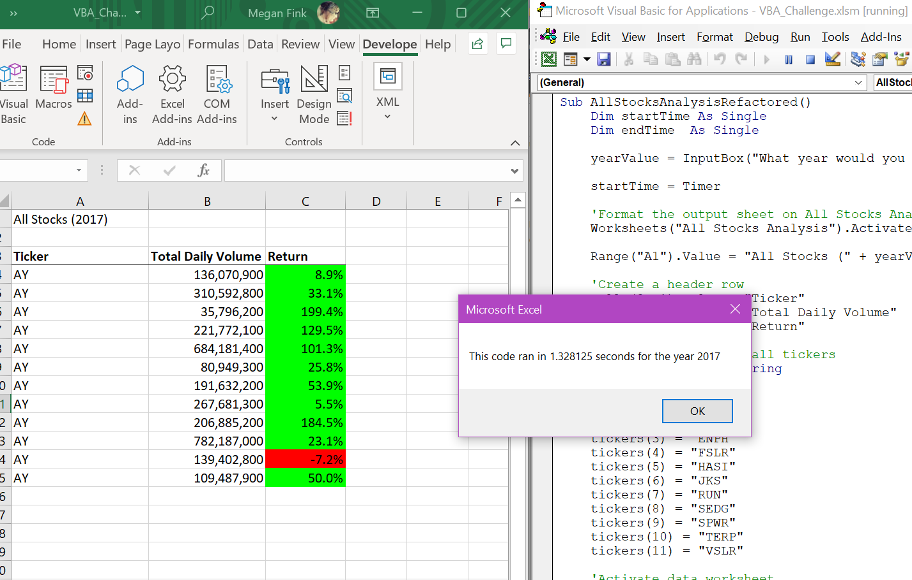
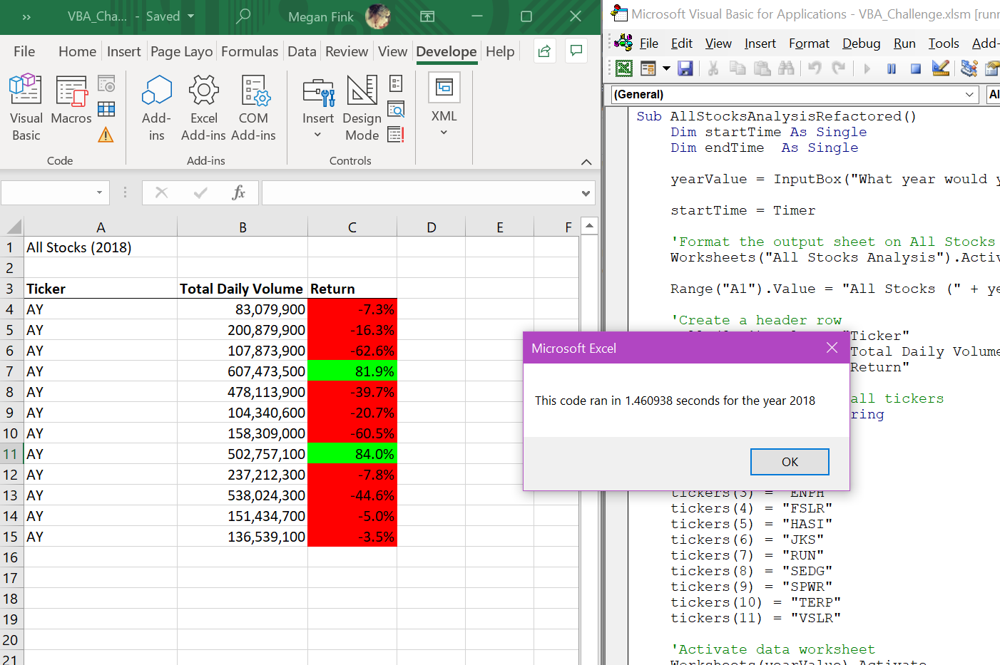

# VBA Stocke Challenge

## Overview of Project

This project was initiated to analyze stock performances, based on yearly returns, to help make an informed decision on investments. Then explored how to do so on a wider scale, efficiently. 

### Purpose
     
The purpose of this project was to explore varies stocks while building a VBA code that can be used and reused and understood by another on their own.  	
       	
## Result

While I believe one purpose of refactoring the code was to shorten the run time in which it took the code to perform a stock analysis, however, I don’t believe I achieved that goal.  When compared to my original code, before refactoring, my run time did not decrease by much if at all.  The following images display the refactored run time for stock analysis of years 2017 and 2018.

##Summary

-	What are the advantages or disadvantages of refactoring code?

Advantages to refactoring code would are finding ways to clean up the code to make it easier to understand while being more manageable with an increase in usability.

The disadvantages that I came across while refactoring including time consumption and dead ends.   

-	How do these pros and cons apply to refactoring the original VBA script?
  
The pros for refactoring apply in this situation because we were writing code to give to another. We refactored our original code in hopes he could continue to use the codes on his own, on a potentially and even larger scale of information.

The cons apply in my situation because I feel I spent a lot of time trying to figure out where I was going wrong.  Yes, the code was running but I still feel like I missed something important.  I received help on three separate occasions and still was not able to get everything quite right.  Therefore, eventually reaching a dead end even after putting in lots of variations and time. 
